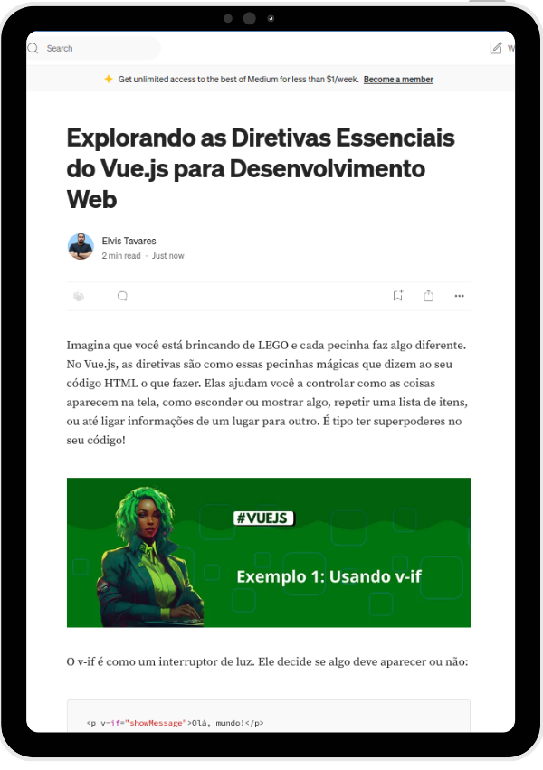

  

# Projeto artigo técnico gerado por I.A.s
## 💻 Tecnologias utilizadas no projeto

<a href="https://medium.com/@elvisptavares/explorando-as-diretivas-essenciais-do-vue-js-para-desenvolvimento-web-f6abc766d72f">Link para o artigo</a>

- [ChatGPT](https://chat.openai.com/) - para título e conteúdo
- [Lexica.art](https://lexica.art/) - para gerar imagens
- [Cnva](https://www.canva.com/) - Para ediçao de imagens

## 📄 Prompts e ferramentas

ChatGPT：

|   Ação   | prompt                                                                                                                                                                                                                                                                         |
| :------: | ------------------------------------------------------------------------------------------------------------------------------------------------------------------------------------------------------------------------------------------------------------------------------ |
|  título  | Crie 5 headlines para nomes de artigos sobre o assunto Angular - Diretivas                                                                                                                                                                                                    |
| conteúdo | Comporte se como um escritor de artigos tech front-end e escreva o artigo atendendo às regras abaixo {REGRAS} >No máximo 5 linhas por blocos de explicação >Me explique de forma informal, como se eu fosse uma criança de 10 anos >os blocos que serão criados estão abaixo: O que sao diretivas em vue cite exemplos com código de diretivas faça um call to action para minhas redes sociais coloque 3 hashtags que façam sentido Crie subtítulos e separe por blocos cada parte do código |

Lexica.art：

- No léxica utilizamos o acervo público de imagens geradas por outras pessoas, os termos de pesquisa que utilizei durante a gravação do conteúdo foram:

• Vue, green cyberpunk

## ✨Features

- Conteúdo gerado via ChatGPT
- Imagens do acervo público geradas via Lexica.art